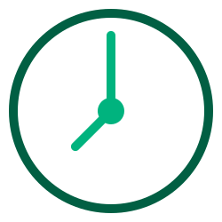
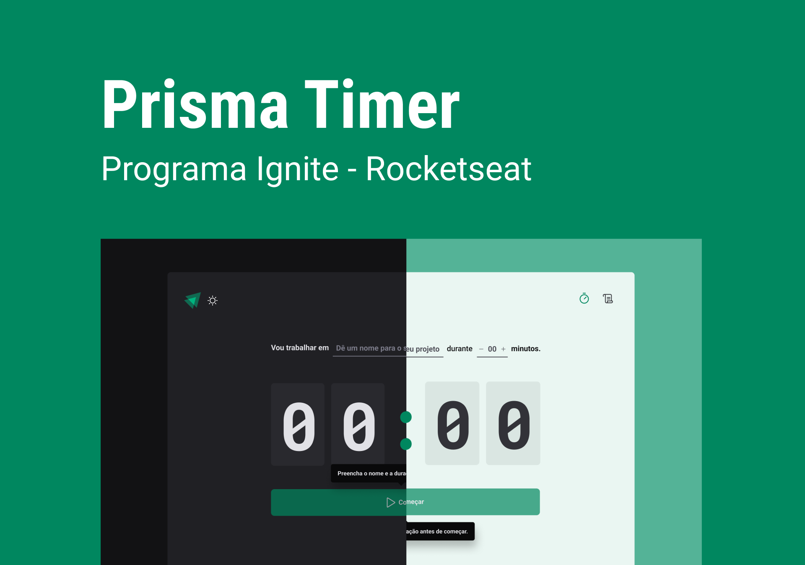

<!-- <p align="center">
  
</p> -->

<h1 align="center">
    
</h1>

<br>

## 💻 Projeto

Você pode acessar o projeto clicando neste link [Acessar Projeto](https://prisma-timer-adairjuneo.vercel.app/)

PrismaTimer é um app bem simples com intuito de ajudar aqueles que desejam ter um tempo determinado para focar em suas atividades.

Este é um projeto desenvolvido durante os estudos da trilha **[Ignite - React](https://lp.rocketseat.com.br/ignite)** by Rocketseat.

## 🧪 Tecnologias

Esse projeto foi desenvolvido com as seguintes tecnologias:

- [React](https://reactjs.org)
- [TypeScript](https://www.typescriptlang.org/)

## 📚 Bibliotecas

Para auxiliar no desenvolvimento do projeto, utilizei as seguinte bibliotecas:

- [zod](https://zod.dev/)
- [date-fns](https://date-fns.org/docs/Getting-Started)
- [ReactHookForm](https://react-hook-form.com/ts/)
- [StyledComponents](https://styled-components.com)

## 🚀 Como executar

Clone o projeto e acesse a pasta, a seguir temos os passos:

```bash
$ git clone https://github.com/adairjuneoaf/prisma-timer
$ cd prisma-timer
```

Para iniciá-lo, siga os passos abaixo:

```bash
# Instalar as dependências
$ yarn
# Iniciar o projeto
$ yarn dev
```

O app estará disponível no seu navegador de internet pelo endereço http://localhost:3000.

## 📝 License

Utilize o projeto a vontade, mas demonstre os mínimos créditos 🧡.

---

Programado por um apaixonado em tecnologia, [Adair Juneo](https://portfolio-adairjuneo.vercel.app/)
